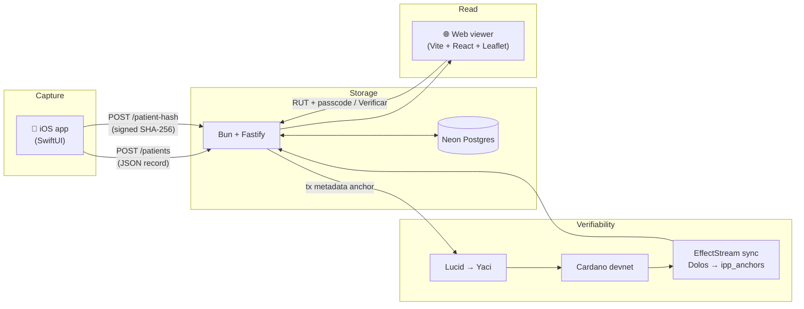

Medical records are an awkward shape for a blockchain. The data itself - a
patient's history, diagnoses, contact details - must stay private; only the
doctor and the patient should see it. But everyone touching it (clinicians,
auditors, the patient themselves a year later) needs to know the record hasn't
been silently rewritten. Privacy *and* verifiability, with neither one
cancelling the other out.

**IPP** is a working application that puts that combination on Cardano,
end-to-end: an iOS app for Chilean doctors and clinical staff to capture
women's-health intake forms, a Bun backend on Neon Postgres, a public web
viewer, and a Cardano anchor that records a hash of each chart on chain. It's
built on EffectStream's local Cardano tooling - [Yaci DevKit](https://github.com/bloxbean/yaci-devkit)
+ [Dolos](https://github.com/txpipe/dolos) and an indexing sync node - and is
open-source at [`effectstream/ipp-demo-app`](https://github.com/effectstream/ipp-demo-app).

<!-- truncate -->



## The shape of the problem

A clinical intake form has roughly seventy questions across four sections -
demographic data, general medical history, gynecological history, and
pelvic-floor assessment, in this case. Each filled-out form belongs to one
patient and ultimately ends up in three places at once:

- **On the doctor's phone**, because that's where it gets captured.
- **In a database**, because clinicians need to look it up later.
- **In the patient's hands**, because they're the one whose data it is.

The challenge isn't storage - Postgres is perfectly happy to hold a JSONB
column. The challenge is *trust*. If the record changes between visits, the
patient has no way to tell. If a doctor wants to prove to an auditor that the
record they're reading today is the same one they saved in March, there's no
built-in mechanism - the row is just bytes controlled by whoever has the
connection string.

The anchor pattern fixes that without putting any private data on chain.

## The anchor pattern

On Cardano you don't need a smart contract to anchor a hash - you attach it to
**transaction metadata**. IPP submits a tiny self-payment transaction carrying a
metadata label (`8327`) with three fields:

```jsonc
// tx metadata, label 8327
{
  "t": "ipp",                                  // kind: "ipp" record | "ipp-study" Merkle root
  "k": "<SHA-256(rut)>",                       // who, hashed - never the RUT itself
  "v": "<SHA-256(canonical patient JSON)>"     // the record, hashed
}
```

Nothing about the patient's identity or medical content is recoverable from the
chain entry - both `k` and `v` are 32-byte hashes. But given the plaintext
record, anyone can recompute `SHA-256(canonical JSON)`, find the latest anchor
for `SHA-256(rut)`, and check the two match. If they don't, the record changed
since it was anchored. This is Cardano's own
[CIP-100](https://cips.cardano.org/cip/CIP-0100) "anchor" convention - a
rootHash written on chain to attest off-chain data - applied to clinical charts.

The same shape scales up: a *study* anchors one Merkle root over a whole cohort
of record hashes (`t: "ipp-study"`), so a published dataset can be validated
against a single on-chain value without ever putting the records on chain.

On a recent end-to-end run on the local devnet:

| Stage | Result |
|---|---|
| `CardanoAdapter.submit` → Lucid builds tx + metadata | submitted via the Yaci admin API |
| Yaci devnet | tx confirmed in seconds |
| Dolos → `CardanoTransfer` primitive → state machine | row written to `ipp_anchors` |
| `CardanoAdapter.read` / `GET /api/v1/onchain/:key` | returns the on-chain value - matches the submitted hash |

No proof server, no contract deploy, no ZK toolchain - a metadata transaction
confirms quickly and costs a fraction of an ada.

## How EffectStream made the rest disappear

The interesting part isn't submitting a transaction - it's *reading chain state
back as application state*. EffectStream does that with one command and a few
lines of glue:

- **The devnet is one command.** `cd cardano && bun run dev` brings up Yaci
  DevKit (a local Cardano node + faucet) and Dolos (a relay with a
  Blockfrost-compatible API and a UTxO-RPC stream), plus a pglite database and
  the sync node - all **native binaries, no Docker**.
- **A primitive turns chain data into rows.** EffectStream's `CardanoTransfer`
  primitive streams each transaction's metadata; a ~15-line state-machine
  transition filters for label `8327` and writes `{ tx, kind, k, v, block }`
  into an `ipp_anchors` table.
- **The app reads a table, not the chain.** Verification - `GET /verify/:rut`
  and the map's "Verificar en cadena" popup - just queries `ipp_anchors`. The
  chain is the source of truth; the synced table is the always-available read
  model, so the app never opens a second connection to a node.

The backend's `CardanoAdapter`
([`backend/src/adapters/cardano.ts`](https://github.com/effectstream/ipp-demo-app/blob/main/backend/src/adapters/cardano.ts))
is under 120 lines and only knows two things: how to build a metadata
transaction with [Lucid](https://github.com/Anastasia-Labs/lucid-evolution), and
how to read `ipp_anchors`. Flip `CHAIN=cardano` in `backend/.env` and the same
endpoints that ran against a no-op `local` adapter now anchor and verify on a
real chain - no endpoint changes.

## What made it click

- **No Docker.** Yaci DevKit and Dolos ship as platform binaries via npm, so the
  whole Cardano devnet comes up straight from `bun run dev` - friendly to CI and
  to a laptop demo.
- **One genesis gotcha.** Dolos wants a specific `alonzo-genesis2.json` that the
  template keeps in `contracts-cardano/temp/`; leave it out and Dolos fails to
  bootstrap. Worth knowing if you copy the workspace.

## What's reusable

IPP is intentionally a thin app - most of its surface is shape that generalizes:

- **The metadata-anchor pattern.** A label plus `{ t, k, v }` is the smallest
  useful Cardano anchor for any "I have private data, I want to prove it hasn't
  changed" application. No contract required.

- **The primitive → table sync.** The `CardanoTransfer` primitive + a tiny state
  transition is a clean template for *any* "watch chain metadata, project it into
  an app table" use case - not just anchors.

- **The schema-driven form.** The clinical questionnaire is a JSON schema stored
  in Postgres, fetched and cached by both the iOS app and the web viewer. Editing
  it in the web "Configurar" tab reshapes the iOS form on next launch without an
  App Store release. Any vertical that needs a configurable intake form - surveys,
  audits, field inspections - can drop this in.

- **The mock-wallet derivation.** Each demo account derives a deterministic
  Cardano-style address from username + password, identical byte-for-byte between
  Swift and TypeScript. A teaching aid, not a security primitive, but the
  cross-platform determinism is useful.

The code is MIT-licensed; PRs against the [demo repo](https://github.com/effectstream/ipp-demo-app)
are welcome.

## Why this matters

Privacy-preserving verifiability is one of those phrases that sounds abstract
until a real record is in front of you. Health data is one of the cleanest
examples - the data itself must stay private, but the guarantee that it hasn't
been silently edited is the difference between a record and a story.

EffectStream's job here is to make that combination cheap to assemble. The
interesting work in IPP is the SwiftUI form, the Chilean clinical instruments,
and the schema editor - the parts specific to *this* application. The Cardano
stack underneath is a metadata transaction, one sync primitive, and an
orchestrator command. That ratio is the point.

## Try it

```bash
git clone https://github.com/effectstream/ipp-demo-app
cd ipp-demo-app
# Cardano devnet - yaci + Dolos + sync node, native binaries, no Docker
cd cardano && bun install && bun run dev
# Backend (separate terminal)
cd ../backend && cp .env.example .env   # set DATABASE_URL; CHAIN=cardano
bun install && bun run dev               # http://localhost:3334
# Web viewer (separate terminal)
cd ../web && bun install && bun run dev   # http://localhost:5174
# iOS app
cd ../ios && xcodegen generate && open IPP.xcodeproj
```

Anchored records show up in `ipp_anchors` with a real Cardano `tx_id`. The
patient's RUT and record stay in Postgres; only their hashes ever touch the chain.
